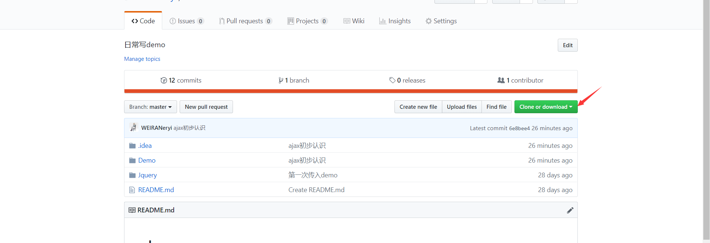

##Git

###目录
1. Git介绍 
2. Git账号的注册
3. Git软件的下载
4. 下载项目
5. 初始化本地仓库
6. 推送代码
7. GitHub网站的使用
8. 主要命令

####1.Git介绍
Git是全球最大的社区交流网站，采用了先进的**分布式版本控制系统**。使得写代码的时候，可以随意回退以及前进到任意版本
就相当于windows系统的还原点，任意时刻想要回退的时候，只要点击一下系统就可以回到设置的还原点的时候。写代码的时候也是一样，
Git能自动帮我们记录文件的改动，还可以回退版本。其次Git对于多人协作有着巨大的作用，如果不用Git的话，想要多人协作就必须拿着
U盘或者上传到云盘，每次改动的时候都要上传一次，而使用了Git之后，直接每个人都上传到远程仓库，然后组长看一眼改动的地方，不合适的
就返回去重新改，合适的就合并到master中。

####2.Git账号的注册
直接进入https://github.com 官网右上角会有sign in和sign up两个选项，第一个是登陆，第二个则是注册。注册注意的是，username尽量短并且
易于记忆，因为日后会经常输入-。-，密码的话要求有大写字母，小写字母，数字。邮箱则选择常用邮箱。

####3.Git软件的下载
windows下载：
https://git-scm.com/downloads 点击链接选择windows然后选择64位还是32位，不知道的查看下自己电脑配置即可。
下载完毕傻瓜式安装即可。直到鼠标左键刷新下边能出现**git gui here和git bash here**。gui是git开发的可视化管理工具，
bash则是命令行，推荐先使用命令行熟悉git。

####4.下载项目
进入github官网，点击一个项目，进入到项目的主页面，上方一列第一个是code代码页面，第二个是issues问题列表，
可以在这里和社区内的人进行交流，相当于贴吧发帖。第三个pull request，如果有人fork了你的项目，然后上传了一部分修改，
作为项目创始人，可以在着查看相关的推送请求，如果你觉得有用的话，可以同意推送合并到你的代码中，如果觉得没什么用，可以拒绝
setting则是项目相关设置，项目名字和删除项目等都可以在这里进行设置。
点击图中标识位置可以复制项目url，在本地打开bash，git clone即可down下该项目

####5.初始化本地仓库
打开bash命令行，输入**git init**即可初始化本地仓库，然后推送代码绑定远程仓库即可。(推送详情请查看6.推送代码)

####6.推送代码
当本地电脑存在和远程仓库绑定成功的本地仓库，就可以进行代码的编写。当写完一部分，开始推送代码。
首先输入**git status**，查看本地仓库和远程仓库之间的差别，查看此次修改的所有文件和修改内容。
第二步输入**git add .** 将修改所有文件提交到文件暂存区。注意这里的 **.** 是代表将所有文件都提交到暂存区。也可以单独文件提交
 **git add 文件名称** 即可。例如git add index.html就是将修改的index.html文件提交到暂存区
 第三步输入 **git commit -m 注释** 注释中可以任意添加相关信息，主要用来注释此次修改内容，比如 git commit -m 第一次提交
 第四步输入 **git push** 就可以将文件暂存区中的文件提交到远程仓库，提交完毕就可以在远程仓库查看当次提交成功。
 
 ####7.GitHub网站的使用
 GitHub作为免费的开源远程仓库，现在也开放了免费闭源仓库，只要在setting中设置相关信息即可更改项目的开源与否。
 如果想要参与一个开源项目的开发，点击fork即可。就在自己账号下克隆了一个相关项目的仓库，然后在自己账号下down下相关代码。
 注意一定要在自己的账号下clone仓库，这样你才可以推送自己的修改。如果是从别人的地方直接clone，是没有修改权限的，无法进行修改的推送。
 当你觉得你修改的地方非常有意义，可以在GitHub上发起一个pull request，对方就可以查看你的推送请求，当然，同不同意另说。
  ####8. 主要命令
  git status  查看git的状态
  
  git log  查看版本历史
  
  git chekout -- <file> 将操作回滚（工作区的修改放弃）
  
  git reset --hard commitID  回到某个版本
  
  git reset HEAD file  （将暂存区的文件移除）
  
  git init  初始化本地仓库
  
  查看分支：git branch
  
  创建分支：git branch <name>
  
  切换分支：git checkout <name>
  
  创建+切换分支：git checkout -b <name>
  
  合并某分支到当前分支：git merge <name>
  
  删除分支：git branch -d <name>
  
  从github上clone代码：git clone url
  
  将文件存入缓存区：git add 文件名 文件名 。。。。。。
  
  将文件提交：git commit -m 描述
  
  将文件推入远程仓库：git push 